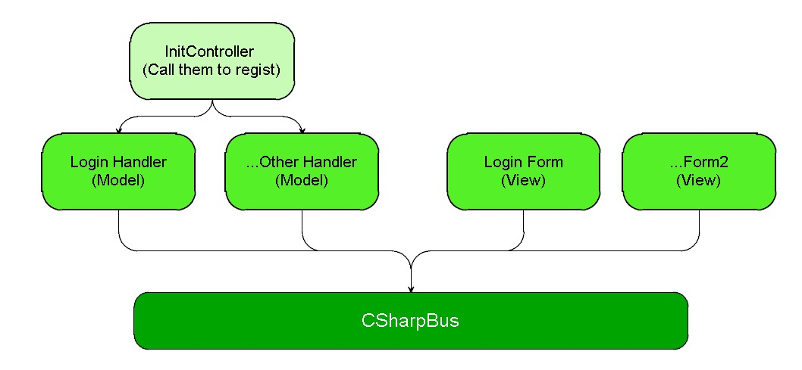

#CSharpBus

##What is CSharpBus
CSharpBus is just a simple class that help you to simplify the relationship of classes.

As you can see in the example, the relationship of classes now look like this:



The LoginForm or Handler don't have to get the instance of each other now. The view just need some fun to handle it's data and get the result of it, so it just ask the bus to provide a function, and then call it.

Besides, with CSharpBus, you can test single class easily because there were no classes-link now.

So, if you want to simplify the relationship between classes in a lightweight project, just use it. 

##How to use CSharpBus
1. Get on the bus: Registe your function with an id

```CSharp
	//In a class that provides CanLogin( ) function:
	internal void Init()
	{
	    //Registe func like a service, so the other guy can call this func:
	    CallbackBus.Register("OnLogin", (BoolCallbackWithStrs) CanLogin);
	 }

	public bool CanLogin(string[] strs)
	{
		//...
	}
 ```


2.Now other classes that want to use this function "CanLogin()" can call like this:

```CSharp
	//Get the function
	BoolCallbackWithStrs method = CallbackBus.GetBoolCallbackWithStrs(funcName);

	//Call it
	bool checkResult = method(new string[] { userName, userPsw });
```

##Note
Like you've got to get on the bus so the other guy can find you, so you got to registe your function so that other classes can call it.
In 'CSharpBusTest', I create a class named 'InitController' to take controll of classes registing. If you want to set your own framework, you can improve it with reading XML to configure the registing like Spring.